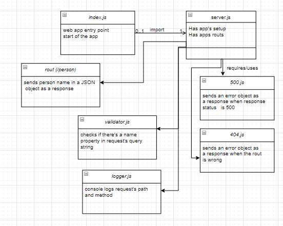

# basic-express-server

## About

* ##  basic Express server made using best practices, including server modularization, use of middleware, and tests. 

<hr>


## Author
Furat Malkawi


<hr>

## Links

* [Submission Pull Request]()

* [Deployed App]()

* [Error Report]()

<hr>

## Setup

1. `(.env)` file 

```
PORT = 4000

```

2. Install the following dependencies

```
npm init -y 

npm i dotenv express

npm i -D jest supertest


```

## Running the app 

1. clone the repo.

2. Enter the command `npm start`

3. Use endpoints :

   
<br>

### * (`/person?name='yourname'`)
  
- **Method** : GET 
- **Functionality** : sends back the name in request query string as a response 
- **Response Body**   : JSON
  
  
```
    {
    name: ahmad,
    }
```

<br>

### * not-existing endpoint
  
- **Method** : GET 
- **Functionality** : invokes 404 error handler 
- **Response Body**   : JSON
  
  
```
    {
    status: 404,
    message: 'page not found'
    }
```

<br>

4. Test . 

* There's 1 test file : server.test.js
   

* In terminal run :

```
npm test
```


<br><br><br>

<hr>

<br><br>


## UML Diagram

<br><br>


